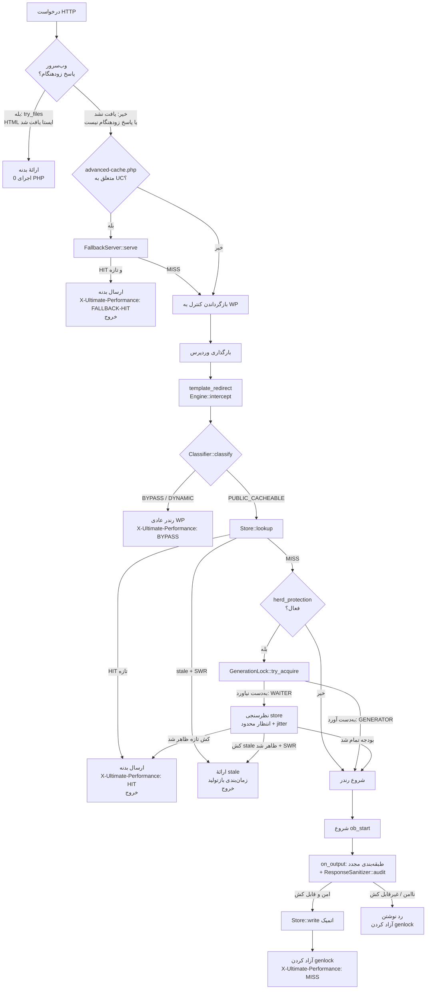

# مرجع فنی

[English](technical.md) | فارسی

این سند به چرخهٔ حیات درخواست، تولید کلید کش، چیدمان ذخیره‌سازی، نوشتن‌های اتمیک، GenerationLock، ابطال، مدیریت WooCommerce، EnvironmentDetector، جایگزین advanced-cache.php و شتاب‌دهی Nginx می‌پردازد.

## چرخهٔ حیات درخواست



## تولید کلید کش

`UltimatePerformance\CacheKey\Key::build()` تنها نقطهٔ ورود است. این متد scheme، host، path، query و یک نقشهٔ accept/UA می‌گیرد و `{key, dir, file, variants, query_used}` یا `false` هنگام ناامن بودن ورودی برمی‌گرداند.

### قانونی‌سازی host

`Key::canonical_host($host)` لایهٔ دفاعی host است. این متد:

- ورودی را lower-case و whitespace را trim می‌کند.
- ورودی‌های > 253 نویسه یا دارای کاراکتر کنترلی، whitespace یا `/ \ ? # @ % [ ]` را رد می‌کند.
- یک `:port` انتهایی را (مثلاً `example.com:8080` ← `example.com`) **پیش از** شاخهٔ IPv6 بدون براکت حذف می‌کند — در غیر این صورت `example.com:8080` با یک IPv6 literal اشتباه گرفته می‌شد.
- IPv6 با براکت (`[2001:db8::1]`) و IPv6 بدون براکت را می‌پذیرد و هر کدام را به یک فرم بدون کولون قطعی (`[<hex>]`) برای ایمنی FS تبدیل می‌کند.
- نقطهٔ انتهایی FQDN را حذف می‌کند (`example.com.` ← `example.com`).
- نام host را در برابر یک regex سختگیرانه برچسب اعتبارسنجی می‌کند.
- هنگام هر شکستی `''` برمی‌گرداند — فراخوان (`Classifier`) مقدار خالی را به‌عنوان `BYPASS` در نظر می‌گیرد.

`Classifier::host_allowed()` host قانونی را به allowlist سایت محدود می‌کند: hostِ `home_url()` به‌علاوه، در مالتی‌سایت، همهٔ سایت‌های شبکه. `SERVER_NAME` هرگز قابل اعتماد نیست (می‌تواند روی سرورهای نادرست پیکربندی‌شده توسط مهاجم کنترل شود).

### نرمال‌سازی مسیر

`Classifier::normalize_path($path)`:

- مسیرهای > 2048 نویسه، دارای کاراکتر کنترلی یا backslash را رد می‌کند.
- یک pass از urldecode؛ ورودی‌های کدگذاری‌شدهٔ دوگانه (`%252e`) را رد می‌کند.
- اجراهای `//` را فشرده می‌کند، بخش‌های `.` را حذف می‌کند، `..` را outright رد می‌کند.
- بخش‌های دارای whitespace یا کاراکتر کنترلی را رد می‌کند.
- برای نتیجهٔ خالی `/` برمی‌گرداند.

### قانونی‌سازی کوئری

`Key::canonical_query($query)`:

- هر پارامتر tracking در `Classifier::TRACKING_PARAMS` را حذف می‌کند.
- تنها پارامترهای allowlist را نگه می‌دارد، مگر اینکه `query_unknown_policy = 'variant'` باشد.
- کلیدها را صعودی مرتب می‌کند، کلیدها و مقادیر را URL-encode می‌کند و یک رشتهٔ قطعی تولید می‌کند.

### نگاشت مسیر و ROOT_SENTINEL

`Key::dir_for($host, $normalized_path, $variants)` پوشهٔ کش را تولید می‌کند:

1. host به یک فرم امن برای نام فایل کاهش می‌یابد (حذف `[^a-z0-9.\[\]\-]`).
2. هر بخش مسیر از `Key::segment()` عبور می‌کند:
   - `.` و `..` هش می‌شوند (دفاع در عمق — هرگز نباید پس از `normalize_path` به اینجا برسند).
   - بخش‌های منطبق با `^[a-z0-9][a-z0-9._\-]{0,63}$` (case-folded برای مدیریت NTFS/macOS) بدون هش عبور می‌کنند.
   - هر چیز دیگر به `h<sha1[:20]>` هش می‌شود.
3. **اگر مسیر خالی باشد (صفحهٔ اصلی `/`)**، پوشه `<host>/uc-root/` است — با استفاده از ثابت `ROOT_SENTINEL = "uc-root"`. این اصلاح BENCH-D5 / HARDEN-2 است: یک بخش معتبر، بدون هش که از regex `segment()` عبور می‌کند، تا مسیر کش صفحهٔ اصلی بین نویسندهٔ PHP، قوانین تولید‌شدهٔ Nginx و قوانین `try_files` دست‌نویس یکدست باشد.
4. بخش‌های فراتر از `MAX_DEPTH = 6` به یک پوشهٔ هش‌شدهٔ واحد (`<sha1[:16]>.d/`) فرومی‌پاشند.
5. واریانت‌ها (مثلاً `webp`) به‌صورت `@webp` پسوند می‌گیرند.
6. کوئری‌های allowlist با یک پیشوند SHA1 16 کاراکتری متمایز می‌شوند: `dir .= '@q' . substr(sha1($query_used), 0, 16)`.

`Key::absolute($rel_dir, $name)` ریشهٔ کش، `v/`، rel_dir و نام فایل (پیش‌فرض `index.html`) را به هم می‌پیوندد. هر بخش را پیش از پیوستن از طریق `segment()` مجدداً sanitize می‌کند — دفاع در عمق — و symlinks را در سایت فراخوان رد می‌کند.

### چیدمان پوشهٔ کش

```
wp-content/cache/ultimate-performance/
  v/<host>/<seg1>/<seg2>/.../index.html            بدنه
  v/<host>/<seg1>/<seg2>/.../index.html.meta.json  status، headers، ttl، created، tags[]، uuid7 id
  v/<host>/uc-root/index.html                      بدنهٔ صفحهٔ اصلی
  v/<host>/uc-root/index.html.meta.json            متای صفحهٔ اصلی
  v/<host>/<seg>/@webp/index.html                 بدنهٔ واریانت webp
  v/<host>/<seg>/@q<sha1[:16]>/index.html         بدنهٔ واریانت کوئری allowlist
  meta/<tag-hash>.json                            ایندکس معکوس tag ← rel_dir
  meta/node-id.json                               هویت گره خوشه (از purge-all جان سالم می‌برد)
  meta/checkpoint.json                            checkpoint اثبات‌شدهٔ پوشش به‌ازای گره
  genlocks/<sha1[:32]>.lock                       فایل‌های قفل بازتولید
  stats.jsonl                                     لاگ آماری محدود (≤128 KB)
  .htaccess                                       قوانین رد سخت‌شدهٔ ذخیره‌سازی
```

## نوشتن‌های اتمیک

`UltimatePerformance\Core\SafeFs::write_atomic($path, $data)`:

1. مسیر را به‌صورت لغوی + دربری‌گیری ریشه از طریق `validate_write()` اعتبارسنجی می‌کند. اعتبارسنجی عمیق‌ترین جدول موجود را پیمایش می‌کند، آن را `realpath()` می‌کند (سینک‌ها و junctionها را فرومی‌پاشد) و بررسی می‌کند که مسیر حل‌شده درون یک ریشهٔ مجاز قرار دارد. دو هندسهٔ معتبر پشتیبانی می‌شوند: (الف) جدول درون ریشه (عادی)؛ (ب) زیردرخت ریشه کاملاً مفقود (نصب تازه/پاک‌شده) — تنها هنگامی پذیرفته می‌شود که `realpath` ثابت کند جدول حل‌شده فیزیکی ریشه را در بر دارد.
2. اگر عمیق‌ترین جدول موجود یک symlink باشد، نوشتن را رد می‌کند.
3. در صورت نیاز پوشهٔ والد را با `wp_mkdir_p()` می‌سازد.
4. در یک فایل temp یکتا (`.<unique>.tmp`) در همان پوشه می‌نویسد.
5. `fflush()` + `fclose()` برای flush بافر OS.
6. `rename()` به هدف — اتمیک روی POSIX، نیازمند delete-then-rename روی نقض اشتراک ویندوز (5 retry × 20 ms).
7. تنها هنگام rename موفق `true` برمی‌گرداند. هنگام شکست، فایل temp حذف می‌شود.

خوانندگان قدیمی یا جدید را می‌بینند، هرگز جزئی نه. هر عمل FS افزونه از `SafeFs` عبور می‌کند.

`Store::write()` بدنه را از طریق `write_atomic()` می‌نویسد، سپس sidecar `index.html.meta.json` را (همچنین از طریق `write_atomic()`) می‌نویسد؛ اگر نوشتن متا شکست بخورد، بدنه حذف می‌شود — هرگز بدنه‌ای بدون متا باقی نگذارید.

## GenerationLock (بازتولید کش تک‌پرواز)

`UltimatePerformance\PageCache\GenerationLock` (BENCH-D7 / HARDEN-1) از بازتولید کش thundering-herd جلوگیری می‌کند.

```php
$genlock = new GenerationLock( $rel_dir );
if ( $genlock->try_acquire( $ttl ) ) {
    // ما GENERATOR هستیم. رندر + capture + نوشتن کش، سپس آزاد کردن.
    // ... Engine::begin_capture() + on_output() ...
    $genlock->release();
} else {
    // ما WAITER هستیم. نظرسنجی store با انتظار محدود + jitter.
    $fresh = $genlock->wait_for_generation( $store, $on_stale, $wait_budget_us );
    if ( is_array( $fresh ) && $fresh['found'] && $fresh['fresh'] ) {
        serve_from_cache( $fresh );
        exit;
    }
    // بودجه تمام شد: بازگشت به رندر به‌عنوان آخرین راه‌حل.
}
```

قفل مبتنی بر `flock` از طریق `Core\Lock\FileLock` است. بازیابی از کرش: `flock` هنگام مرگ پروسهٔ PHP به‌طور خودکار آزاد می‌شود. فایل قفل در `<cache_root>/genlocks/<sha1[:32]>.lock` قرار دارد.

نظرسنجی منتظر:

- پایهٔ فاصلهٔ نظرسنجی: 20 ms.
- jitter نظرسنجی: 0 تا 15 ms (تصادفی به ازای هر نظرسنجی).
- بودجهٔ انتظار کل: `genlock_wait_budget_us` (پیش‌فرض 2.5 ثانیه).
- اگر کش تازه در طول انتظار ظاهر شود ← ارائهٔ آن.
- اگر کش stale ظاهر شود و `swr_enabled = true` ← یک‌بار stale از طریق callback `$on_stale` (که خارج می‌شود) ارائه کنید؛ اگر بازگردد، به نظرسنجی ادامه دهید.
- اگر بودجه تمام شود ← بازگشت به رندر (آخرین راه‌حل، اما هرگز بن‌بست نیست).

`Engine::maybe_release_genlock()` تضمین می‌کند که اگر مسیر نوشتن generator رد شده باشد (HTML ناامن، وضعیت غیر-200 و غیره)، قفل آزاد شود تا منتظرها تا TTL مسدود نشوند.

## ابطال کش

`UltimatePerformance\CacheInvalidation\Hooks` هوک‌های وردپرس را به پاک‌سازی‌های تگ متصل می‌کند. واژگان تگ:

- `post:<id>`، `post_type:<type>` (مثلاً `post_type:product`).
- `term:<id>`.
- `product:<id>`، `shop_archive`.
- `front_page`، `blog_home`.
- `archive:<type>` (بازگشت برای انواع محتوای ناشناخته).

### نقشهٔ هوک

| هوک | کنش |
|---|---|
| `save_post` / `delete_post` | `purge_post` |
| `edit_term` / `created_term` / `delete_term` | `purge_term` |
| `transition_comment_status` | `purge_comment` |
| `wp_insert_comment` | `purge_new_comment` |
| `delete_comment` | `purge_deleted_comment` (اصلاح HOOK-1 — حذف نظر محتوای صفحه را تغییر می‌دهد اما transition وضعیتی شلیک نمی‌کند) |
| `woocommerce_update_product` | `purge_product` |
| `woocommerce_update_options` | `purge_woocommerce_pages` |
| `ultimate_cache_purge_tag` | `purge_by_tag` |
| `ultimate_cache_purge_url` | `purge_url` |

### ابطال ناهمگام + همگام ترکیبی (BENCH-D6 / HARDEN-4)

`Hooks::purge_post()` (و `purge_product()`) پیش از فن‌اوت تگ، `sync_purge_permalink( $post )` را فراخوانی می‌کنند:

1. `sync_purge_permalink` پیوند یکتای پست را از طریق `get_permalink()` حل می‌کند و `purge_url()` را روی آن فراخوانی می‌کند.
2. `purge_url()` هم `https://` و هم `http://` را امتحان می‌کند، کلید کش را برای هر کدام می‌سازد و `purge_dir()` را فراخوانی می‌کند — که بدنهٔ کش‌شده، فایل متا و شیء را از تگ‌هایش در ایندکس معکوس جدا می‌کند.
3. **سپس** پاک‌سازی گسترده‌تر مبتنی بر تگ (`post:<id>`، `post_type:<type>`، `front_page`، `blog_home`، `term:<id>` و غیره) از طریق `QueueManager::enqueue('purge_dirs', ...)` برای پردازش ناهمگام در صف قرار می‌گیرد.

پاک‌سازی همگامِ مستقیم، تضمین می‌کند که برای صفحهٔ ویرایش‌شده حدود 0 ثانیه staleness است. فن‌اوت ناهمگام چند ثانیه staleness را برای صفحات ثانویه (بایگانی‌ها، فیدها، صفحهٔ اصلی، دسته‌ها) می‌پذیرد — این معاوضهٔ استاندارد در ابطال کش تولید است.

### ایندکس معکوس

`UltimatePerformance\CacheTag\Registry` یک ایندکس معکوس `meta/tag-<md5(tag)>.json` را نگه می‌دارد که rel_dirهای دارای هر تگ را فهرست می‌کند. `Registry::attach()` توسط `Store::write()` پس از وجود فایل‌های بدنه و متا فراخوانی می‌شود. `Registry::members()` rel_dirها را برای یک تگ برمی‌گرداند؛ `Hooks::purge_tags()` آن‌ها را جمع و پاک‌سازی را در صف می‌کند.

### ابطال خوشه

در راه‌اندازی‌های چندگره‌ای که یک MariaDB/MySQL را به اشتراک می‌گذارند، جدول رویداد خوشه `{base_prefix}uc_invalidation_events` رویدادهای نسخه‌دار را حمل می‌کند. تولیدکننده‌ها epoch مشترک را **پیش از** انتشار یک رویداد افزایش می‌دهند؛ مصرف‌کننده‌ها رویدادهای بیگانهٔ معلق را در هوک WP-Cron `ultimate_performance_tick`، به ترتیب epoch، دستهٔ محدود (200، قابل فیلتر) تخلیه می‌کنند. برای طراحی کامل به [docs/OPERATIONS.md §14](OPERATIONS.md) مراجعه کنید.

## ابطال WooCommerce

Classifier از طریق تنظیمات `bypass_paths` از `cart`، `checkout`، `my-account`، `wc-api`، `wishlist`، `compare`، `order-pay`، `order-received`، `orders`، `view-order`، `edit-address`، `lost-password`، `customer-logout` عبور می‌کند. عبور از کوکی‌ها، کوکی‌های سبد/نشست ووکامرس را از طریق `cookie_bypass_regex` (`woocommerce_`، `wp_woocommerce_session_`) شکار می‌کند.

`ResponseSanitizer` (BENCH-D4 / HARDEN-3) مصنوعات **رندرشدهٔ** ووکامرس را که ممکن است در صفحات در غیر این‌صورت قابل‌کش ظاهر شوند، شکار می‌کند:

- **آیتم‌های سبد رندر‌شده**: یک `<li>` با `class="...mini_cart_item..."` **و** یک ویژگی `data-product_id=` (ظرف سبد خالی عبور می‌کند — یک placeholder ساختاری است).
- **جمع کل سبد رندر‌شده**: `woocommerce-mini-cart__total` و به دنبال آن `woocommerce-Price-amount` (درون 300 نویسه).
- **شمارش سبد رندر‌شده**: `cart-count` و به دنبال آن `woocommerce-Price-amount` (درون 200 نویسه).
- **nonceهای هر نشست**: `woocommerce-cart-nonce`، `data-cart-nonce`.
- **تأیید سفارش / ورودی فرم checkout**: `woocommerce-order-overview`، `billing_email`.
- **قیمت‌گذاری خاص مشتری**: `customer-price`.

رویکرد قبلی broad-substring (مثلاً `woocommerce-mini-cart-item`) هر صفحهٔ واقعی ووکامرس را بیش‌ازحد مسدود می‌کرد، زیرا ظرف سبد خالی در 100٪ صفحات موجود است. الگوهای معنایی اکنون تنها محتوای **رندر‌شدهٔ وابسته به نشست** را تطبیق می‌دهند.

`Hooks::purge_product()` به‌صورت همگام پیوند یکتای محصول را باطل می‌کند، سپس `post:<id>`، `product:<id>`، `post_type:product`، `shop_archive`، `front_page` را برای فن‌اوت ناهمگام در صف می‌گذارد. `Hooks::object_tags()` تضمین می‌کند که صفحهٔ shop هم به‌عنوان `shop_archive` و هم به‌عنوان `post_type:product` تگ شود (صفحهٔ shop ووکامرس همزمان یک صفحهٔ WP تک‌تکی و بایگانی محصول است — تگ‌های بایگانی باید پیروز شوند، در غیر این‌صورت پاک‌سازی shop با هیچ‌چیز تطبیق نمی‌یابد).

## EnvironmentDetector

`UltimatePerformance\Core\EnvironmentDetector` (HARDEN-6) وضعیت سلامت قابل‌مشاهده در پیشخوان را فراهم می‌کند. برای پنج وضعیت حالت به [docs/hosting-fa.md](hosting-fa.md) مراجعه کنید.

`run_self_test()` یک ورودی پروب کش در `self-test.local/uc-verify-<token>/` با بدنهٔ یکتا می‌نویسد، آن را می‌خواند و حذف می‌کند. قبولیِ خودآزمایی ثابت می‌کند که ریشهٔ کش قابل‌نوشتن و قابل‌خواندن است. پروب یک verify شتاب‌دهی سرور **نیست** — آن فروشگاه کش را آزمایش می‌کند، نه پیکربندی پاسخ ایستای وب‌سرور را. برای تأیید شتاب‌دهی سرور، از پروب تأیید Nginx (`WebServer\Nginx\Rules::probe_uri()` / `probe_body()`) استفاده کنید.

## جایگزین advanced-cache.php (HARDEN-5)

`UltimatePerformance\Compatibility\AdvancedCacheDropin::install()` فایل `wp-content/advanced-cache.php` را تولید و به‌صورت اتمیک می‌نویسد. کد تولیدشده:

1. با `<?php` آغاز می‌شود (PHP در غیر این‌صورت فایل را به‌عنوان متن ساده در نظر می‌گیرد).
2. کامنت `OWNERSHIP_MARKER` را به‌عنوان خط دوم جای‌گذاری می‌کند.
3. در صورت تعریف‌نبودن، `WP_CONTENT_DIR` و `ULTIMATE_PERFORMANCE_DIR` را تعریف می‌کند.
4. `Autoloader` افزونه را بارگذاری و `\UltimatePerformance\Compatibility\FallbackServer::serve()` را فراخوانی می‌کند.
5. **هیچ** Shim تابع WP تعریف نمی‌کند (`wp_normalize_path`، `wp_parse_url`، `trailingslashit`) — با نسخه‌های واقعی WP که بعداً توسط `wp-includes` بارگذاری می‌شوند تعارض ایجاد می‌کردند.

`FallbackServer::serve()`:

1. از هر متد غیر GET / غیر HEAD عبور می‌کند.
2. تنظیمات را مستقیماً از پایگاه‌داده از طریق `mysqli` بارگذاری می‌کند (نه `get_option()` — آن تابع هنوز بارگذاری نشده است).
3. یک بررسی ساده‌شدهٔ cacheability انجام می‌دهد (کوکی‌ها، مسیرهای عبور، کوئری‌استرینگ‌ها).
4. مسیر فایل کش را تنها با توابع داخلی PHP و کلاس‌های خودِ افزونه محاسبه می‌کند (host ← حذف port به سبک `Key::canonical_host` ← بخش‌های dir ← فایل کش).
5. اگر فایل موجود، تازه و بدنه > 64 بایت باشد: هدرهای ذخیره‌شده را ارسال می‌کند، `X-Ultimate-Performance: FALLBACK-HIT` را تنظیم می‌کند، وضعیت HTTP را تعیین می‌کند، بدنه را echo و خارج می‌شود.
6. در MISS یا stale-past-grace: کنترل را به وردپرس بازمی‌گرداند.

اصلاح 0.6.1 به `FallbackServer` پورت را از `HTTP_HOST` (مثلاً `127.0.0.1:8095` ← `127.0.0.1`) پیش از محاسبهٔ مسیر کش حذف می‌کند، که با رفتار حذف portِ `Key::canonical_host()` همخوان است. بدون این اصلاح، جایگزین به دنبال `v/127.0.0.18095/index.html` به جای `v/127.0.0.1/index.html` می‌گشت و هرگز HIT پیدا نمی‌کرد.

## شتاب‌دهی Nginx

`UltimatePerformance\WebServer\Nginx\Rules::generate()` یک بلاک کامل `http{}` تولید می‌کند:

- **دروازهٔ نقشهٔ مرکب**: `$up_method_ok` (GET/HEAD = 1)، `$up_cookieless` (هدر `Cookie:` خالی = 1)، `$up_static` (ترکیب = `"1|1|"` = 1). `if ($up_static) { rewrite ... last; }` در هر location تصمیم پاسخ زودهنگام را می‌گیرد.
- **مسیر کش فقط-داخلی**: `location ^~ /up-cache/ { internal; alias <cache_root>/v/; try_files $uri @up_dynamic; }`. درخواست‌های خارجی مستقیم 404 دریافت می‌کنند.
- **عدم ارائهٔ `.php` از دیسک**: هر درخواست `.php` به مبدا PHP پروکسی می‌شود (نگهبان افشای کد منبع).
- **بازگشت `@up_dynamic`**: URI اصلی را با هدرهای `Host`، `X-UP-Original-URI`، `X-Real-IP` و `X-Forwarded-For` به مبدا PHP پروکسی می‌کند.
- **`X-UP-Original-URI`** یک بار به ازای هر درخواست در فاز rewrite سرور، `$request_uri` را شکار می‌کند، تا بازگشت dynamic حتی پس از rewrite پاسخ ایستا، URI اصلی را ببیند.
- **دروازه‌های ورودی fail-closed**: هر ورودی (host، cache_root، docroot، listen، origin) در برابر الگوهای سختگیرانه اعتبارسنجی می‌شود. هر ورودی غیرقابل‌استفاده باعث می‌شود مولد `''` برگرداند — هرگز یک پیکربندی شکسته تولید نکنید.
- **یکدستی ROOT_SENTINEL**: بلاک `location = / { ... }` به `/up-cache/<host>/uc-root/index.html` بازنویسی می‌کند — دقیقاً همان مسیری که `Key::dir_for('/')` می‌نویسد. پیش از 0.6.1، صفحهٔ اصلی از یک بخش هش‌شده استفاده می‌کرد و قوانین سادهٔ `try_files` هرگز آن را پیدا نمی‌کردند.

پروب تأیید (`probe_uri()` / `probe_body()`) اثبات وضعیت فعال است: مدیر یک فایل پروب در `/uc-verify-<token>/` با بدنهٔ بایت‌به‌بایت می‌نویسد، سپس یک درخواست HTTP می‌فرستد. اگر بدنهٔ پاسخ دقیقاً با `probe_body($token)` مطابقت داشته باشد، قطعه به‌صورت ایستا پاسخ می‌دهد.

## همچنین ببینید

- [معماری](ARCHITECTURE.md) — جداسازی لایه، خلاصهٔ مدل تهدید، استراتژی به‌ازای سرور.
- [نمای کلی امنیت](security-fa.md) — محافظت‌ها در برابر مسمومیت کش، مدیریت host، مالکیت درآپ‌این.
- [بنچمارک](benchmarks-fa.md) — دادهٔ کارایی تأییدشده.
- [اشکال‌زدایی](troubleshooting-fa.md) — اشکال‌زدایی چرخهٔ حیات درخواست.
