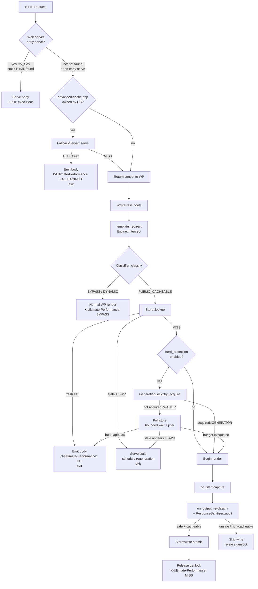

# Technical reference

English | [فارسی](technical-fa.md)

This document covers the request lifecycle, cache key generation,
storage layout, atomic writes, the GenerationLock, invalidation,
WooCommerce handling, the EnvironmentDetector, the advanced-cache.php
fallback, and Nginx acceleration.

## Request lifecycle



## Cache key generation

`UltimatePerformance\CacheKey\Key::build()` is the single entry point. It
takes scheme, host, path, query, and an accept/UA map, and returns
`{key, dir, file, variants, query_used}` or `false` when the input is
unsafe.

### Host canonicalization

`Key::canonical_host($host)` is the host defense layer. It:

- Lowercases the input and trims whitespace.
- Rejects inputs > 253 chars or containing control chars, whitespace, or
  `/ \ ? # @ % [ ]`.
- Strips a trailing `:port` (e.g. `example.com:8080` → `example.com`)
  **before** the bare-IPv6 branch — otherwise `example.com:8080` would
  be mistaken for an IPv6 literal.
- Accepts bracketed IPv6 (`[2001:db8::1]`) and bare IPv6, converting
  each to a deterministic colon-free form (`[<hex>]`) for FS safety.
- Strips the trailing dot from an FQDN (`example.com.` → `example.com`).
- Validates the hostname against a strict label regex
  (`^[a-z0-9]([a-z0-9-]{0,61}[a-z0-9])?(\.[a-z0-9]([a-z0-9-]{0,61}[a-z0-9])?)*$`).
- Returns `''` on any failure — the caller (`Classifier`) treats empty
  as `BYPASS`.

`Classifier::host_allowed()` further restricts the canonical host to
the site's allowlist: `home_url()` host plus, on Multisite, every site
in the network. `SERVER_NAME` is never trusted (it can be
attacker-controlled on misconfigured servers).

### Path normalization

`Classifier::normalize_path($path)`:

- Rejects paths > 2048 chars, containing control chars or backslashes.
- Single urldecode pass; rejects double-encoded inputs (`%252e`).
- Collapses `//` runs, drops `.` segments, rejects `..` outright.
- Rejects segments containing whitespace or control chars.
- Returns `/` for the empty result.

### Query canonicalization

`Key::canonical_query($query)`:

- Drops every tracking param in `Classifier::TRACKING_PARAMS`
  (`utm_*`, `gclid`, `fbclid`, `msclkid`, `dclid`, `twclid`, `mc_eid`,
  `igshid`, `_ga`).
- Keeps only allowlisted params (default `p`, `page_id`, `page`,
  `paged`, `feed`, `lang`) unless `query_unknown_policy = 'variant'`
  (which keeps unknowns too).
- Sorts keys ascending, URL-encodes keys and values, and produces a
  deterministic string.

### Directory mapping and ROOT_SENTINEL

`Key::dir_for($host, $normalized_path, $variants)` produces the cache
directory:

1. The host is reduced to a filename-safe form
   (`[^a-z0-9.\[\]\-]` stripped).
2. Each path segment is passed through `Key::segment()`:
   - `.` and `..` are hashed (defense in depth — they should never
     reach here after `normalize_path`).
   - Segments matching `^[a-z0-9][a-z0-9._\-]{0,63}$` (case-folded to
     handle NTFS / macOS case-insensitivity) pass through unhashed.
   - Anything else is hashed to `h<sha1[:20]>`.
3. **If the path is empty (homepage `/`)**, the directory is
   `<host>/uc-root/` — using the `ROOT_SENTINEL = "uc-root"` constant.
   This is the BENCH-D5 / HARDEN-2 fix: a valid, unhashed segment that
   passes through `segment()`'s regex, so the homepage cache path is
   consistent between the PHP writer, the generated Nginx rules, and
   hand-written `try_files` rules.
4. Segments beyond `MAX_DEPTH = 6` collapse into a single hashed dir
   (`<sha1[:16]>.d/`) to cap depth.
5. Variants (e.g. `webp`) are suffixed as `@webp`.
6. Allowlisted query strings are discriminated by a 16-char SHA1 prefix:
   `dir .= '@q' . substr(sha1($query_used), 0, 16)`.

`Key::absolute($rel_dir, $name)` joins the cache root, `v/`, the
rel_dir, and the file name (default `index.html`). It re-sanitizes every
segment via `segment()` before joining — defense in depth — and rejects
symlinks at the caller site.

### Cache directory layout

```
wp-content/cache/ultimate-performance/
  v/<host>/<seg1>/<seg2>/.../index.html            body
  v/<host>/<seg1>/<seg2>/.../index.html.meta.json  status, headers, ttl, created, tags[], uuid7 id
  v/<host>/uc-root/index.html                      homepage body
  v/<host>/uc-root/index.html.meta.json            homepage meta
  v/<host>/<seg>/@webp/index.html                 webp variant body
  v/<host>/<seg>/@q<sha1[:16]>/index.html         allowlisted-query variant body
  meta/<tag-hash>.json                            tag → rel_dir reverse index
  meta/node-id.json                               cluster node identity (survives purge-all)
  meta/checkpoint.json                            per-node proven-coverage checkpoint
  genlocks/<sha1[:32]>.lock                       generation lock files
  stats.jsonl                                     bounded stats log (≤128 KB)
  .htaccess                                       hardened storage deny rules
```

## Atomic writes

`UltimatePerformance\Core\SafeFs::write_atomic($path, $data)`:

1. Validates the path lexically + root containment via
   `validate_write()`. The validation walks the deepest existing
   ancestor, `realpath()`s it (collapsing symlinks **and** junctions),
   and verifies the resolved path sits inside an allowed root. Two
   valid geometries are supported (see inline comment): (A) ancestor
   inside the root (normal); (B) root subtree missing entirely
   (fresh/wiped install) — accepted only when `realpath` proves the
   resolved ancestor physically contains the root.
2. Refuses to write if the deepest existing ancestor is a symlink.
3. Creates the parent directory with `wp_mkdir_p()` if needed.
4. Writes to a unique temp file (`.<unique>.tmp`) in the same directory.
5. `fflush()` + `fclose()` to flush the OS buffer.
6. `rename()` to the target — atomic on POSIX, requires delete-then-
   rename on Windows sharing violations (5 retries × 20 ms).
7. Returns `true` only on a successful rename. On failure, the temp
   file is unlinked.

Readers see old-or-new, never partial. Every plugin FS op routes
through `SafeFs`.

`Store::write()` writes the body via `write_atomic()`, then writes the
sidecar `index.html.meta.json` (also via `write_atomic()`); if the meta
write fails, the body is deleted — never leave a body without meta.

## GenerationLock (single-flight cache regeneration)

`UltimatePerformance\PageCache\GenerationLock` (BENCH-D7 / HARDEN-1) prevents
thundering-herd cache regeneration.

```php
$genlock = new GenerationLock( $rel_dir );
if ( $genlock->try_acquire( $ttl ) ) {
    // We are the GENERATOR. Render + capture + write cache, then release.
    // ... Engine::begin_capture() + on_output() ...
    $genlock->release();
} else {
    // We are a WAITER. Poll the store with bounded wait + jitter.
    $fresh = $genlock->wait_for_generation( $store, $on_stale, $wait_budget_us );
    if ( is_array( $fresh ) && $fresh['found'] && $fresh['fresh'] ) {
        serve_from_cache( $fresh );
        exit;
    }
    // Budget exhausted: fall through to render as last resort.
}
```

The lock is `flock`-based via `Core\Lock\FileLock`. Crash recovery:
`flock` is dropped automatically when the PHP process dies. The lock
file lives at `<cache_root>/genlocks/<sha1[:32]>.lock`.

Waiter polling:

- Poll interval base: 20 ms.
- Poll jitter: 0–15 ms (random per poll).
- Total wait budget: `genlock_wait_budget_us` (default 2.5 s).
- If a fresh cache appears during the wait → serve it.
- If a stale cache appears and `swr_enabled = true` → serve stale once
  via the `$on_stale` callback (which exits); if it returns, keep
  polling.
- If the budget is exhausted → fall through to render (last resort,
  but never a deadlock).

`Engine::maybe_release_genlock()` ensures that if the generator's
write path was bypassed (unsafe HTML, non-200 status, etc.), the lock
is released so waiters are not blocked until TTL.

## Cache invalidation

`UltimatePerformance\CacheInvalidation\Hooks` wires WordPress hooks to tag
purges. Tag vocabulary:

- `post:<id>`, `post_type:<type>` (e.g. `post_type:product`).
- `term:<id>`.
- `product:<id>`, `shop_archive`.
- `front_page`, `blog_home`.
- `archive:<type>` (fallback for unknown content types).

### Hook map

| Hook | Action |
|---|---|
| `save_post` / `delete_post` | `purge_post` |
| `edit_term` / `created_term` / `delete_term` | `purge_term` |
| `transition_comment_status` | `purge_comment` |
| `wp_insert_comment` | `purge_new_comment` |
| `delete_comment` | `purge_deleted_comment` (HOOK-1 fix — comment deletion changes page content but fires no status transition) |
| `woocommerce_update_product` | `purge_product` |
| `woocommerce_update_options` | `purge_woocommerce_pages` |
| `ultimate_cache_purge_tag` | `purge_by_tag` |
| `ultimate_cache_purge_url` | `purge_url` |

### Hybrid sync + async invalidation (BENCH-D6 / HARDEN-4)

`Hooks::purge_post()` (and `purge_product()`) call
`sync_purge_permalink( $post )` **before** the tag fanout:

1. `sync_purge_permalink` resolves the post's permalink via
   `get_permalink()` and calls `purge_url()` on it.
2. `purge_url()` tries both `https://` and `http://` variants, builds
   the cache key for each, and calls `purge_dir()` — which deletes the
   cached body, the meta file, and detaches the object from its tags in
   the reverse index.
3. **Then** the broader tag-based purge (`post:<id>`, `post_type:<type>`,
   `front_page`, `blog_home`, `term:<id>`, etc.) is enqueued via
   `QueueManager::enqueue('purge_dirs', ...)` for asynchronous
   processing.

The synchronous direct purge guarantees ~0 second stale exposure for
the edited page itself. The async fanout accepts a few seconds of
staleness for secondary pages (archives, type feeds, front page, terms)
— this is the standard trade-off in production cache invalidation.

### Reverse index

`UltimatePerformance\CacheTag\Registry` maintains a reverse index
`meta/tag-<md5(tag)>.json` listing the rel_dirs that carry each tag.
`Registry::attach()` is called by `Store::write()` after the body and
meta files exist. `Registry::members()` returns the rel_dirs for a tag;
`Hooks::purge_tags()` collects them and enqueues the purge.

### Cluster invalidation

On multi-node setups sharing one MariaDB/MySQL database, the cluster
event table `{base_prefix}uc_invalidation_events` carries versioned
events. Producers bump the shared epoch **before** publishing an event;
consumers drain pending foreign events on the `ultimate_performance_tick`
WP-Cron hook, in epoch order, bounded batch (200, filterable). See
[docs/OPERATIONS.md §14](OPERATIONS.md) for the full design.

## WooCommerce invalidation

The Classifier bypasses `cart`, `checkout`, `my-account`, `wc-api`,
`wishlist`, `compare`, `order-pay`, `order-received`, `orders`,
`view-order`, `edit-address`, `lost-password`, `customer-logout` via
the `bypass_paths` setting. Cookie bypasses catch WooCommerce cart /
session cookies via `cookie_bypass_regex` (`woocommerce_`,
`wp_woocommerce_session_`).

The `ResponseSanitizer` (BENCH-D4 / HARDEN-3) catches **rendered** Woo
artifacts that might appear on otherwise-cacheable pages:

- **Rendered cart items**: an `<li>` with `class="...mini_cart_item..."`
  **and** a `data-product_id=` attribute (the empty cart container
  passes through — it's a structural placeholder).
- **Rendered cart totals**: `woocommerce-mini-cart__total` followed by a
  `woocommerce-Price-amount` (within 300 chars).
- **Rendered cart counts**: `cart-count` followed by
  `woocommerce-Price-amount` (within 200 chars).
- **Per-session nonces**: `woocommerce-cart-nonce`, `data-cart-nonce`.
- **Order confirmation / checkout form input**: `woocommerce-order-overview`,
  `billing_email`.
- **Customer-specific pricing**: `customer-price`.

The previous broad-substring approach (e.g. `woocommerce-mini-cart-item`)
over-blocked every real Woo page because the empty cart container is
present on 100% of pages. The semantic patterns now match only
**rendered, session-bound** content.

`Hooks::purge_product()` synchronously purges the product's own
permalink, then enqueues `post:<id>`, `product:<id>`,
`post_type:product`, `shop_archive`, `front_page` for async fanout.
`Hooks::object_tags()` ensures the shop page is tagged as both
`shop_archive` and `post_type:product` (the Woo shop page is
simultaneously a singular WP page and the product archive — the archive
tags must win, otherwise shop purges match nothing).

## EnvironmentDetector

`UltimatePerformance\Core\EnvironmentDetector` (HARDEN-6) provides
admin-visible health status. See [docs/hosting.md](hosting.md) for the
five mode states.

`run_self_test()` writes a probe cache entry under
`self-test.local/uc-verify-<token>/` with a unique body, reads it back,
and deletes it. A passing self-test proves that the cache root is
writable and readable. The probe is **not** a server-acceleration
verify — it tests the cache store, not the web server's static-serve
configuration. For server-acceleration verification, use the Nginx
verify probe (`WebServer\Nginx\Rules::probe_uri()` /
`probe_body()`).

## advanced-cache.php fallback (HARDEN-5)

`UltimatePerformance\Compatibility\AdvancedCacheDropin::install()` generates
and atomically writes `wp-content/advanced-cache.php`. The generated
code:

1. Starts with `<?php` (PHP treats the file as plain text otherwise).
2. Embeds the `OWNERSHIP_MARKER` comment as the second line.
3. Defines `WP_CONTENT_DIR` and `ULTIMATE_PERFORMANCE_DIR` if not already
   defined.
4. Loads the plugin's `Autoloader` and calls
   `\UltimatePerformance\Compatibility\FallbackServer::serve()`.
5. **Does not** define any WP function shims (`wp_normalize_path`,
   `wp_parse_url`, `trailingslashit`) — they would conflict with the
   real WP versions loaded later by `wp-includes`.

`FallbackServer::serve()`:

1. Bypasses any non-GET / non-HEAD method.
2. Loads settings directly from the database via `mysqli` (not
   `get_option()` — that function is not yet loaded at this point).
3. Performs a simplified cacheability check (cookies, bypass paths,
   query strings).
4. Computes the cache file path using only PHP built-ins and the
   plugin's own classes (host → `Key::canonical_host`-style stripping of
   port → dir segments → cache file).
5. If the file exists, is fresh, and the body is > 64 bytes: emits the
   stored headers, sets `X-Ultimate-Performance: FALLBACK-HIT`, sets the HTTP
   status, echoes the body, and exits.
6. On MISS or stale-past-grace: returns control to WordPress.

The 0.6.1 fix to `FallbackServer` strips the port from `HTTP_HOST`
(e.g. `127.0.0.1:8095` → `127.0.0.1`) before computing the cache path,
matching `Key::canonical_host()`'s port-stripping behavior. Without
this fix, the fallback looked for `v/127.0.0.18095/index.html` instead
of `v/127.0.0.1/index.html` and never found a HIT.

## Nginx acceleration

`UltimatePerformance\WebServer\Nginx\Rules::generate()` produces a complete
`http{}` include:

- **Composite map gate**: `$up_method_ok` (GET/HEAD = 1),
  `$up_cookieless` (empty `Cookie:` header = 1), `$up_static`
  (combination = `"1|1|"` = 1). The `if ($up_static) { rewrite ...
  last; }` in each location performs the early-serve decision.
- **Internal-only cache location**: `location ^~ /up-cache/ { internal;
  alias <cache_root>/v/; try_files $uri @up_dynamic; }`. Direct external
  requests receive a 404.
- **`.php` never served from disk**: every `.php` request is proxied
  to the PHP origin (source-disclosure guard).
- **`@up_dynamic` fallback**: proxies the original URI to the PHP origin
  with `Host`, `X-UP-Original-URI`, `X-Real-IP`, and
  `X-Forwarded-For` headers.
- **`X-UP-Original-URI`** captures `$request_uri` once per request in
  the server rewrite phase, so the dynamic fallback sees the original
  URI even after the static-serve rewrite.
- **Fail-closed input gates**: every input (host, cache_root, docroot,
  listen, origin) is validated against strict patterns. Any unusable
  input causes the generator to return `''` — never emit a broken
  config.
- **ROOT_SENTINEL consistency**: the `location = / { ... }` block
  rewrites to `/up-cache/<host>/uc-root/index.html` — exactly the path
  that `Key::dir_for('/')` writes. Pre-0.6.1, the homepage used a hashed
  segment and simple `try_files` rules never found it.

The verify probe (`probe_uri()` / `probe_body()`) is the active-status
proof: the admin writes a probe file at `/uc-verify-<token>/` with a
byte-identical body, then issues an HTTP request. If the response body
matches `probe_body($token)` exactly, the snippet is serving statically.

## See also

- [Architecture](ARCHITECTURE.md) — layer separation, threat model summary, per-server strategy.
- [Security overview](security.md) — cache poisoning protections, host handling, drop-in ownership.
- [Benchmarks](benchmarks.md) — verified performance data.
- [Troubleshooting](troubleshooting.md) — debugging the request lifecycle.
